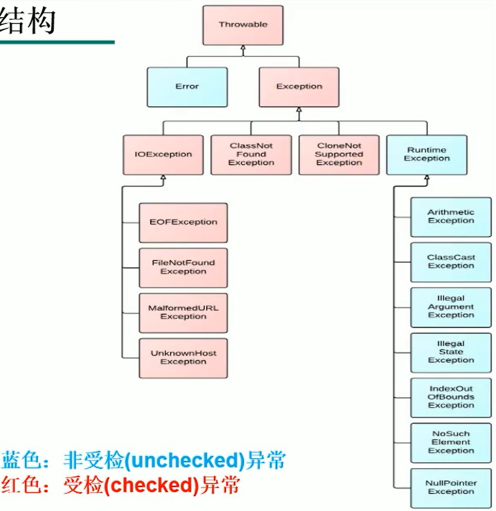
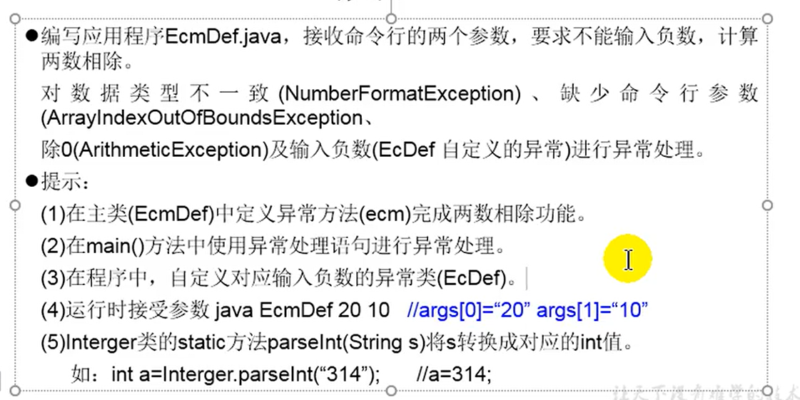

# 异常(Exception)

## 一、Throwable的分类: java.lang.Throwable

### 1. Error(错误): java.lang.Error

    Java虚拟机无法解决的严重问题。 ——> 一般不编写针对性的代码进行处理。

### 2. Exception(异常): java.lang.Exception

    其他因编程错误或偶然的外在因素导致的一般性问题。 ——> 可以使用针对性代码进行处理。

* 解决方法

  * 遇到错误就终止程序。
  * 由程序员在编写程序时，就考虑到错误的检测、错误消息的提示，以及错误的处理。


* 异常分类

  * 编译时异常
    * IOException
      * FileNotFoundException
    * ClassNotFoundException
  * 运行时异常 (RunTimeException)
    * 空指针异常：NullPointerException
    * 数组角标越界异常：ArrayIndexOutOfBoundsException
    * 类型转换异常：ClassCastException
    * 数值类型异常：NumberFormatException
    * 输入不匹配异常：InputMismatchException
    * 算数异常：ArithmeticException


## 二、异常处理

### 0. 抓抛模型

* 过程一：”抛“：程序在正常执行的过程中，一旦出现异常，就会在异常代码处生成一个对应异常类的对象，并将此对象抛出。一旦对象抛出后，其后的代码就不再执行。

* 过程二（抓）：可以理解为异常处理的方式
  * try-catch-finally
  * throws


### 1. 机制一：try-catch-finally

#### 1.1 代码结构

```java
try{
    //可能出现异常的代码
        }catch(异常类型1 变量名1){
        // 处理异常的方式1
        }catch(异常类型2 变量名2){
        // 处理异常的方式2
        }catch(异常类型3 变量名3){
        // 处理异常的方式3
        }
        ...
    finally{
        //一定会执行的代码
        }
```

* finally是可选的
* 使用try将可能出现异常的代码包装起来，在执行过程中，一旦出现异常，就会生成一个对应异常类的对象，根据此对象的类型，去catch中进行匹配。
* 一旦try中的异常对象匹配到某一catch时，就进入catch中进行异常处理。一旦处理完成就跳出当前的try-catch结构，继续执行其后的代码。
* catch中的异常类型如果满足子父类的关系，则要求子类必须声明在前。
* 常用的异常对象处理方式
  * `String getMessage()`
  * `printStackTrace()` ——> 更常用
* try-catch-finally也可以嵌套

#### 1.2 try-catch-finally中final的使用

* finally是可选的
* finally中声明的是一定会被执行的代码。即使catch中又出现异常、try中由return语句、catch中有return语句等情况。
* 像数据库连接、输入输出流、网络编程Socket等资源，JVM是不能自动回收的，我们需要自己手动地进行资源的释放。此时的资源释放，就需要声明在finally中。

#### 1.3 总结

* try-catch-finally处理编译时异常，使得编译不报错，但运行时仍有可能报错。即将编译时可能出现的异常，延迟到运行时再出现。
* 开发中，由于运行时异常比较常见，通常只针对编译时异常考虑try-catch-finally异常处理。

### 2. 机制一：throws + 异常类型

```java
public void method() throws FileNotFoundException, IOException{
    //可能出现异常的方法体
        }
```

* 声明再方法的声明处，知名此方法执行时可能会出现的异常。一旦方法执行时出现异常，仍会在代码处生成一个异常的对象，此对象满足throws声明时的异常类型时，就会被抛出。其后的代码不再执行。
* try-catch-finally：真正的将异常处理掉了
* throws：只是将异常抛给了方法的调用者，异常并没有被处理掉。


### 3. 如何选择try-catch-finally 还是 throws

* 如果父类中被重写的方法没有抛出异常，则子类重写的方法也不能使用throws。
  * 如果子类重写的方法有异常，则必须使用try-catch-finally的方法处理。

* 执行的方法a中，先后又调用了另外的几个有递进执行关系的方法，则这几个方法用**throws**的方式进行处理，而执行的方法a可以考虑用**try-catch-finally**的方式进行处理。

*   

### 4. 异常抛出的重写规则

* 子类重写的方法抛出的异常类型不大于父类被重写的方法抛出的异常类型

### 5. 手动抛出异常

#### 5.1 异常对象的产生

* 系统自动生成的异常对象
* 手动生成一个异常对象，并抛出(throw)

#### 5.2 throw与throws

* throw：表示抛出一个异常类的对象，是生成异常对象的过程，声明在方法体内。
* throws：属于异常处理的机制之一，将异常抛给方法的调用者，声明在方法的声明处。

### 6. 自定义异常类

* 继承于现有的异常结构：RuntimeException, Exception
* 提供全局常量：static final long serialVersionUID
* 提供重载的构造器

### 7. 异常的综合练习

