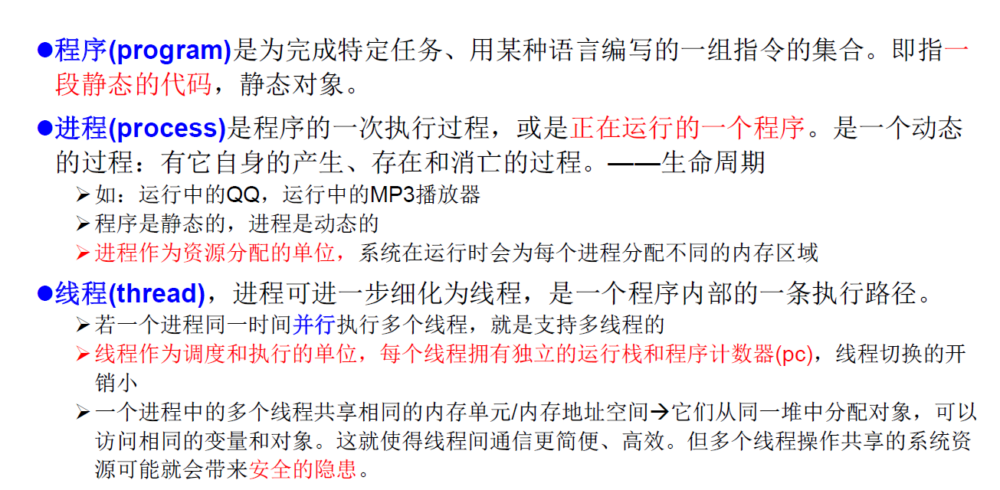

# Day18 多线程

## 一、基本概念

###1. 程序、进程、线程

### 2. 使用多线程的优点

* 提高应用程序的响应。对图形化界面更有意义，可增强用户体验。
* 提高计算机系统CPU的利用率。
* 改善程序结构。将既长又复杂的进程分为多个线程，独立运行，利于理解和修改。

### 3. 何时需要使用多线程

* 程序需要同时执行两个或多个任务。
* 程序需要实现一些需要等待的任务时，如用户输入、文件读写操作、网络操作、搜索等。
* 需要一些后台运行的程序时。

## 二、多线程的创建

### 1. 方式一：继承于Thread类

1. 创建一个继承于Thread类的子类
2. 重写Thread类的run() ——> 将此线程要执行的操作声明在run()中
3. 创建Thread类的子类的对象
4. 通过此对象调用start()方法，其作用是：
   * 启动当前线程
   * 调用当前线程的run()方法

#### 1.1 问题说明

1. 不能直接通过调用run()的方式启动线程。
2. 若要再启动一个线程，则要**再创建一个对象**，然后再start()。

### 2. Thread中的常用方法

* start()
  * 启动当前线程
  * 调用当前线程的run()
* run()
  * 将创建此线程要执行的操作声明在此方法中
* currentThread()
  * 静态方法，返回执行当前代码的线程
  * getName()
    * 获取当前线程的名字
  * setName()
    * 设置当前线程的名字
* yield()
  * 释放当前cpu的线程
* join()
  * 在线程a中调用线程b的join()，此时线程a就进入阻塞状态，直到线程b完全执行完以后，线程acai结束阻塞状态
* sleep(long millis)
  * 让当前线程”睡眠“指定的millis毫秒。在指定的millis毫秒内，当前线程是阻塞状态。

### 3. 线程的调度与优先级

